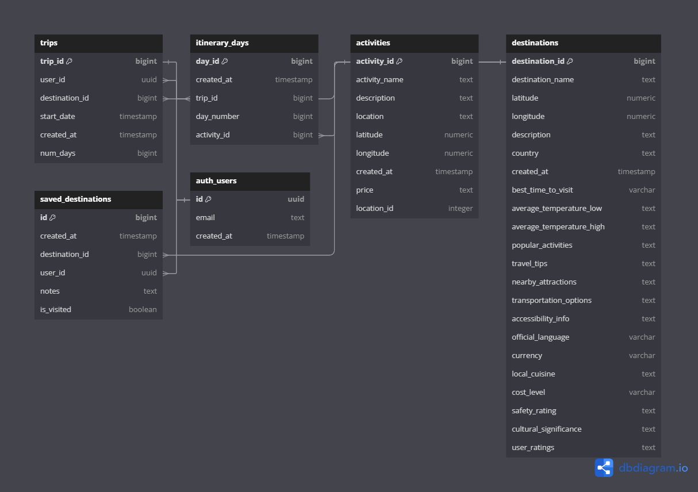

<div align="center">
<h2> Wooster Server </h2>


[](https://github.com/joshuaisaact/Wooster-server/actions/workflows/tests.yml)


## Backend for AI-Powered Trip Planning App

Wooster Server is the backend service for the Wooster AI-powered trip planning application. 

It is built using **Express** and **TypeScript**, it uses **Drizzle** as an ORM, and integrates with **Google's Gemini API** for AI services and **Supabase** for cloud database storage. 

The backend manages trip and destination data, providing API routes for creating, managing, and retrieving trip itineraries and destination details.

[](https://www.typescriptlang.org/)
[](https://nodejs.org/)
[](https://expressjs.com/)
[](https://supabase.com/)
[](https://orm.drizzle.team/)
[](https://www.postgresql.org/)
[](https://jestjs.io/)
[](https://github.com/visionmedia/supertest)

</div>

## Database Schema

Here’s an overview of the database schema for Wooster, managing user trips, itineraries, activities, and destinations:

<div align="center">
  
</div>

## Table of Contents

- [Getting Started](#getting-started)
- [Prerequisites](#prerequisites)
- [Environment Variables](#environment-variables)
- [Installation](#installation)
- [API Routes](#api-routes)
- [Testing](#testing)
- [Utilities](#utilities)
- [License](#license)

## Getting Started

To get the backend server up and running, follow these steps:

### Prerequisites

1. **Google Gemini API Key**: You will need to generate your own Google Gemini API key to use AI features.
2. **Supabase Database**: Create a Supabase account and set up a database to manage your trip and destination data.

### Environment Variables

You will need to create a .env file at the root of the project with the following environment variables. Replace the placeholders with your actual credentials:

```bash

# .env
PORT=your_port_number
SUPABASE_URL=your_supabase_project_url
SUPABASE_KEY=your_supabase_api_key
DATABASE_URL=postgresql://<USER>:<PASSWORD>@<HOST>:<PORT>/<DATABASE>
GOOGLE_GEMINI_API_KEY=your_google_gemini_api_key

```
- Replace your_port_number, your_supabase_project_url, your_supabase_api_key, and your_google_gemini_api_key with your actual credentials.
- In the DATABASE_URL, Supabase provides all the details in your database settings except the password. You will need to replace the password manually when creating the .env file.


### Database Initialization with Drizzle

This project uses [Drizzle ORM](https://orm.drizzle.team/) to manage the database schema. When setting up the project, Drizzle will handle creating and applying the schema to the database.

**Steps to Initialize the Database**

1. **Install Dependencies**: Ensure that all dependencies are installed by running:
```
npm install
```

2. **Run Migrations**: Drizzle will automatically create and apply the necessary database tables and schema defined in the project. To ensure the database is fully initialized or updated, run:
```
npm run drizzle:migrate
```

This will apply any pending migrations and ensure the database schema matches the project’s schema.

**Notes:**

- The schema will be created from scratch if no existing schema is found in the database.
- Drizzle will ensure that the database is kept up-to-date with the latest migrations whenever they are added to the project.
  
Make sure the .env file is properly configured (as detailed above) before running the migration command.

### Installation

1. Clone the repository:

   ```bash

   git clone https://github.com/your-username/wooster-server.git
   ```

2. Navigate to the project directory:

   ```bash

   cd wooster-server
   ```

3. Install dependencies:

   ```bash

   npm install
   ```

4. Start the server:

   ```bash

   npm start
   ```

The server will start on the port specified in your `.env` file.

## API Routes

Here are the available API routes in the application:

### Trip Routes

- **`GET /trips`**: Fetch all trips from the Supabase database. (Requires authentication)
- **`GET /trips/:id`**: Fetch detailed information for a specific trip by its ID. (Requires authentication)
- **`POST /trips`**: Save a new trip to the Supabase database. (Rate-limited, requires authentication)
- **`DELETE /trips/:tripId`**: Delete a trip by its ID from the Supabase database. (Requires authentication)

### Destination Routes

- **`GET /destinations/search`**:  Search for destinations based on query parameters.
- **`GET /destinations/destinationName`**:  Fetch detailed information about a specific destination by name.
- **`GET /destinations`**: Fetch a list of all destinations. (Requires authentication)
- **`GET /destination/:destinationName/activities`**: Retrieve a list of activities for a specific destination by name. (Requires authentication)
- **`POST /destination`**: Add a new destination to the Supabase database. (Rate-limited, requires authentication)
- **`DELETE /destinations/:destinationId`**: Remove a destination by its ID from the Supabase database.

### Saved Destination Routes
- **`GET /saved-destinations`**: Retrieve a list of saved destinations for the current user. (Requires authentication)
- **`POST /saved-destinations/:destinationId`**: Save a destination to the user's saved list by its ID. (Requires authentication)
- **`DELETE /saved-destinations/:destinationId`**: Remove a saved destination by its ID for the current user. (Requires authentication)


## Testing

This project includes unit and integration tests using **Jest** and **Supertest**. To run the tests, use the following command:

```bash
npm test
```

## Utilities

### Clean LLM JSON Response

The cleanLLMJsonResponse utility function cleans the response from a language model by removing markdown code blocks and comments, ensuring the result is a clean string for further parsing.

```typescript
const cleanLLMJsonResponse = (text: string): string => {
  // Remove markdown code blocks with any language specification
  const withoutCodeBlocks = text.replace(
    /```(?:json)?\s*([\s\S]*?)\s*```/g,
    '$1'
  );

  // Remove any potential comments
  const withoutComments = withoutCodeBlocks.replace(
    /\/\*[\s\S]*?\*\/|\/\/.*/g,
    ''
  );

  // Remove any leading/trailing whitespace
  return withoutComments.trim();
};
```

## License

This project is licensed under the MIT License. See the [LICENSE](LICENSE) file for details.
