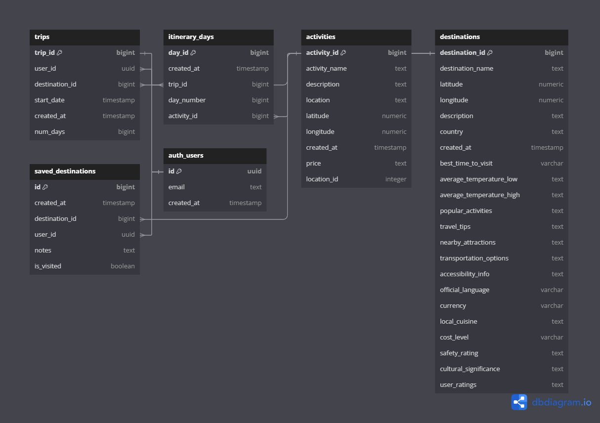

<div align="center">
<h2> Wooster Server </h2>


[](https://github.com/joshuaisaact/Wooster-server/actions/workflows/run-tests.yml)


## Backend for AI-Powered Trip Planning App

Wooster Server is the backend service for the Wooster AI-powered trip planning application. It is built using **Express** and **TypeScript**, and integrates with **Google's Gemini API** for AI services and **Supabase** for database storage. The backend manages trip and destination data, providing API routes for creating, managing, and retrieving trip itineraries and destination details.


)


</div>

## Database Schema

Here’s an overview of the database schema for Wooster, managing user trips, itineraries, activities, and destinations:

<div align="center">
  
</div>

## Table of Contents

- [Getting Started](#getting-started)
- [Prerequisites](#prerequisites)
- [Environment Variables](#environment-variables)
- [Installation](#installation)
- [API Routes](#api-routes)
- [Testing](#testing)
- [Utilities](#utilities)
- [License](#license)

## Getting Started

To get the backend server up and running, follow these steps:

### Prerequisites

1. **Google Gemini API Key**: You will need to generate your own Google Gemini API key to use AI features.
2. **Supabase Database**: Create a Supabase account and set up a database to manage your trip and destination data.

### Environment Variables

You will need to create a `.env` file at the root of the project with the following environment variables:

```bash

# .env
PORT=your_port_number
SUPABASE_URL=your_supabase_project_url
SUPABASE_KEY=your_supabase_api_key
GOOGLE_GEMINI_API_KEY=your_google_gemini_api_key

Replace `your_port_number`, `your_supabase_project_url`, `your_supabase_api_key`, and `your_google_gemini_api_key` with your actual credentials.
```

### Installation

1. Clone the repository:

   ```bash

   git clone https://github.com/your-username/wooster-server.git
   ```

2. Navigate to the project directory:

   ```bash

   cd wooster-server
   ```

3. Install dependencies:

   ```bash

   npm install
   ```

4. Start the server:

   ```bash

   npm start
   ```

The server will start on the port specified in your `.env` file.

## API Routes

Here are the available API routes in the application:

### Auth Routes

- **`POST /auth/register`**: Register a new user.
- **`POST /auth/login`**: Login an existing user.
- **`POST /auth/logout`**: Logout the current user (requires authentication).

### Trip Routes

- **`GET /trips`**: Fetch all trips from the Supabase database.
- **`POST /trip`**: Save a new trip to the Supabase database.
- **`DELETE /trips/:tripId`**: Delete a trip by its ID from the Supabase database.

### Destination Routes

- **`GET /destinations`**: Fetch a list of all destinations.
- **`GET /destinations/:destinationId`**: Fetch detailed information about a specific destination by ID.
- **`POST /destination`**: Add a new destination to the Supabase database.
- **`DELETE /destinations/:destinationId`**: Remove a destination by its ID from the Supabase database.

## Testing

This project includes unit and integration tests using **Jest** and **Supertest**. To run the tests, use the following command:

```bash
npm test
```

## Utilities

The server includes a utility function to reshape the trip data fetched from Supabase into a format suitable for front-end consumption. The function `reshapeTripData` converts the raw database data into a format where trips are nested with their associated activities and days:

```typescript
function reshapeTripData(dbData: any) {
  return dbData.map((trip: any) => ({
    trip_id: trip.trip_id.toString(),
    start_date: trip.start_date,
    num_days: trip.num_days,
    destination_name: trip.destinations.destination_name,
    itinerary: convertActivities(trip.itinerary_days),
  }));
}
```

The helper function `convertActivities` structures the activities by day:

```typescript
function convertActivities(data: any) {
  const result: any[] = [];

  data.forEach((item: any) => {
    const { day_number, activities } = item;
    const dayEntry = result.find((entry) => entry.day === day_number);

    if (dayEntry) {
      dayEntry.activities.push({
        activity_id: activities.activity_id,
        activity_name: activities.activity_name,
        description: activities.description,
        location: activities.location,
        price: activities.price,
        latitude: activities.latitude,
        longitude: activities.longitude,
      });
    } else {
      result.push({
        day: day_number,
        activities: [
          {
            activity_id: activities.activity_id,
            activity_name: activities.activity_name,
            description: activities.description,
            location: activities.location,
            price: activities.price,
            latitude: activities.latitude,
            longitude: activities.longitude,
          },
        ],
      });
    }
  });

  return result;
}
```

## License

This project is licensed under the MIT License. See the [LICENSE](LICENSE) file for details.
